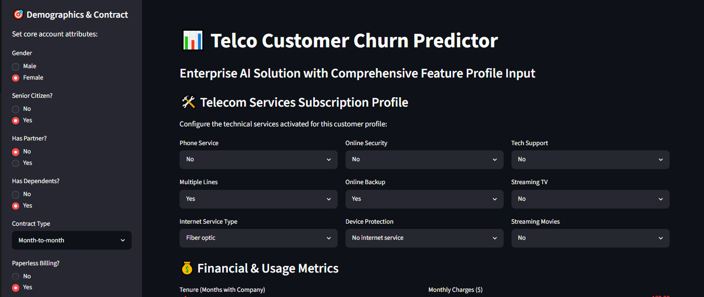
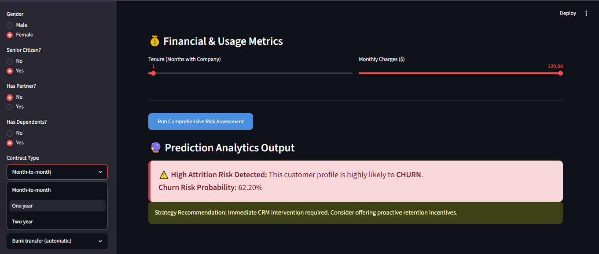

# 📊 Telco Customer Churn Predictor

An end-to-end Machine Learning web application designed to predict telecom customer attrition using **Logistic Regression**. This project incorporates data exploration, handling class imbalance (SMOTE), and model deployment.

## 🚀 Live Demo
https://churn-predictor-biggan.streamlit.app




## 📁 Project Structure
```text
Customer_Churn_Project/
├── data/               # Raw dataset
├── notebooks/          # Exploratory Data Analysis & Training
├── app/                # Streamlit Web App, Scaler & Saved Model
    |---app.py
    |---churn_model.pkl
    |---scaler.pkl              
├── reports/            # Performance charts and UI screenshots
├── requirements.txt    # System dependencies
└── README.md           # Documentation
```

## 🧠 Model Performance Summary
During development, multiple models were evaluated on the test set. **Logistic Regression** was chosen as the production model due to its high **Recall**, which is critical for maximizing customer retention.

| Model | Accuracy | Precision | Recall | F1-Score | ROC-AUC |
| :--- | :--- | :--- | :--- | :--- | :--- |
| **Logistic Regression** | **73.21%** | **49.74%** | **78.07%** | **60.77%** | **0.8342** |
| Tuned Random Forest | 77.47% | 57.44% | 58.82% | 58.12% | 0.8187 |
| XGBoost | 76.90% | 56.20% | 59.36% | 57.74% | 0.8136 |

## 🛠️ Local Setup Instructions

1. Clone the repository:
   ```bash
   git clone https://github.com
   cd Customer_Churn_Project
   ```
2. Install dependencies:
   ```bash
   pip install -r requirements.txt
   ```
3. Run the Streamlit web server:
   ```bash
   cd app
   streamlit run app.py
   ```
